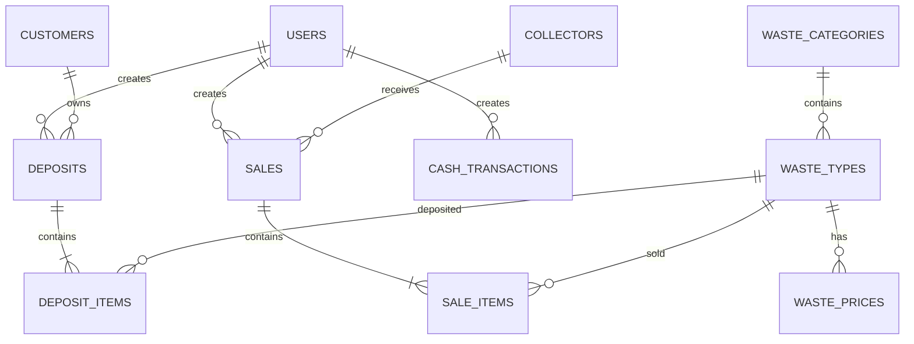

# 08_ERD.md

# Entity Relationship Diagram (ERD)

## Sistem Informasi Bank Sampah (SIBS)

Versi : 1.0

Status : Draft Final

---

# 1. Tujuan

Dokumen ini menjelaskan hubungan antar entitas (Entity Relationship Diagram) pada Sistem Informasi Bank Sampah.

ERD menjadi acuan utama dalam pembuatan:

* Migration
* Model Eloquent
* Foreign Key
* Relasi Laravel
* Seeder

---

# 2. Prinsip Perancangan

ERD dirancang berdasarkan prinsip:

* Third Normal Form (3NF)
* Header–Detail Pattern
* Referential Integrity
* Single Source of Truth

---

# 3. Daftar Entitas

## System

* users
* roles
* permissions

## Master Data

* customers
* collectors
* waste_categories
* waste_types
* waste_prices
* settings

## Transaction

* deposits
* deposit_items
* sales
* sale_items
* cash_transactions

---

# 4. Diagram ERD (Mermaid)

---

# 5. Cardinality

| Parent         | Child            | Relasi |
| -------------- | ---------------- | ------ |
| Customer       | Deposit          | 1 : N  |
| Deposit        | Deposit Item     | 1 : N  |
| Waste Category | Waste Type       | 1 : N  |
| Waste Type     | Waste Price      | 1 : N  |
| Collector      | Sale             | 1 : N  |
| Sale           | Sale Item        | 1 : N  |
| User           | Deposit          | 1 : N  |
| User           | Sale             | 1 : N  |
| User           | Cash Transaction | 1 : N  |

---

# 6. Penjelasan Relasi

## Customer → Deposit

Satu nasabah dapat melakukan banyak transaksi setor.

Satu transaksi setor hanya dimiliki oleh satu nasabah.

---

## Deposit → Deposit Item

Satu transaksi setor dapat terdiri dari banyak jenis sampah.

Setiap detail hanya dimiliki oleh satu transaksi.

---

## Waste Category → Waste Type

Satu kategori memiliki banyak jenis sampah.

---

## Waste Type → Waste Price

Satu jenis sampah memiliki banyak riwayat harga.

Harga terbaru ditentukan berdasarkan tanggal berlaku.

---

## Collector → Sale

Satu pengepul dapat menerima banyak transaksi penjualan.

---

## Sale → Sale Item

Satu transaksi penjualan terdiri dari banyak jenis sampah.

---

## User → Transaction

Setiap transaksi mencatat petugas yang membuat transaksi sebagai audit trail.

---

# 7. Business Constraint

* Seluruh foreign key wajib menggunakan constraint database.
* Tidak diperbolehkan orphan record.
* Transaksi tidak boleh dihapus.
* Harga transaksi menggunakan snapshot.
* Saldo tidak disimpan, tetapi dihitung dari transaksi kas.

---

# 8. Catatan Implementasi Laravel

Relasi Eloquent yang akan digunakan:

* User → hasMany(Deposit)

* User → hasMany(Sale)

* User → hasMany(CashTransaction)

* Customer → hasMany(Deposit)

* Deposit → belongsTo(Customer)

* Deposit → hasMany(DepositItem)

* DepositItem → belongsTo(Deposit)

* DepositItem → belongsTo(WasteType)

* WasteCategory → hasMany(WasteType)

* WasteType → belongsTo(WasteCategory)

* WasteType → hasMany(WastePrice)

* Collector → hasMany(Sale)

* Sale → belongsTo(Collector)

* Sale → hasMany(SaleItem)

* SaleItem → belongsTo(Sale)

* SaleItem → belongsTo(WasteType)

---

# 9. Ruang Lingkup

ERD ini hanya berlaku untuk Release 1.0.

Modul akuntansi seperti:

* Chart of Accounts (COA)
* General Journal
* Ledger
* Trial Balance
* Financial Statement

akan dirancang pada Release 1.1.

---

# 10. Persetujuan

Dokumen ini menjadi dasar resmi sebelum pembuatan:

* Data Dictionary
* Migration Laravel
* Model Eloquent
* Factory
* Seeder
* API Resource
* Feature Test